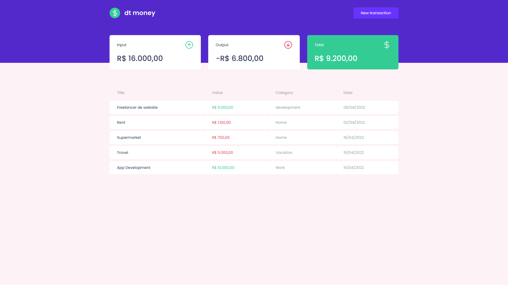
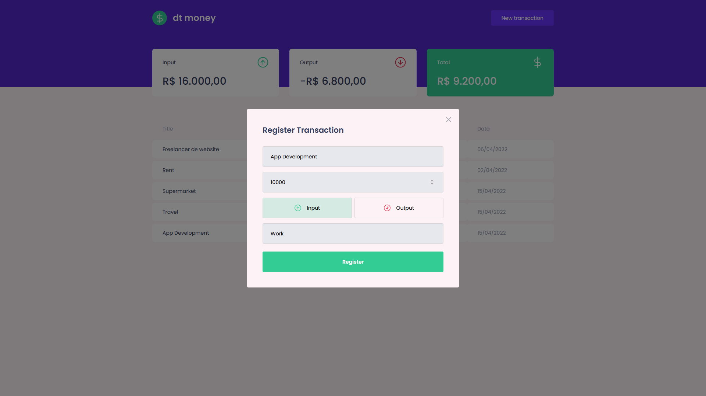

<h1 align="center">
  
</h1>

<p align="center">
  
  
</p>

---
Gerenciador de finanças pessoais desenvolvido com __React.js__ com dados fictícios gerados pelo __Mirage JS__.

## 🚀 Introdução
Sistema criado a partir do Ignite da Rocketseat com o objetivo de praticar os conhecimentos em *React.js* com foco no compartilhamento de estado entre os componentes através da *ContextAPI*.

## 📋 Pré-requisitos

- [Node.js 10+](https://nodejs.org/en/download/)
- [Npm](https://www.npmjs.com/)


## :wrench: Instalação

Para clonar o projeto via HTTPS execute o seguinte comando:

```
git clone https://github.com/oantoniosilva/dt-money.git
```

Em seguida instale as dependências

```
npm install
```

## 🔨 Execução em ambiente de desenvolvimento

Execute a aplicação:

```
npm start
```

## 🛠️ Principais tecnologias utilizadas
- [React.js](https://reactjs.org/) - Biblioteca Javascript focada em criação de interfaces performáticas baseadas em componente.
- [Typescript](https://www.typescriptlang.org/) - Superset Javascript que adiciona tipagem estática à linguagem.
- [Mirage JS](https://miragejs.com/) - Biblioteca para geração de dados fictícios para serem consumidos durante o desenvolvimento do front-end.
- [styled-components](https://styled-components.com/) - Biblioteca que fornece diversos recursos de estilização ao React.
- [React Modal](https://github.com/reactjs/react-modal) - Componente de modal para o React com diversos recursos de acessibilidade integrados.

## 🎉 Agradecimentos

- [@Rocketseat](https://github.com/Rocketseat)

Feito por [Antonio Silva](https://github.com/oantoniosilva)
